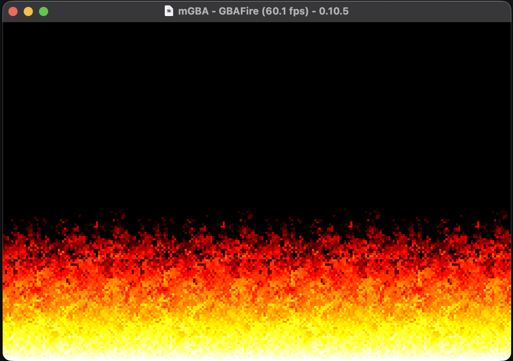

# GBAFire - Doom Fire for GBA

Just a very simple implementation of the Doom Fire algorithm for the Game Boy Advance.

## Preview

## Download

You can find the [latest release over here](https://github.com/Arylen/GBAFire/releases/latest).

## Build

You'll need a [devkitPro](https://devkitpro.org/) environment set up, along with [Just](https://just.systems/man/en/).

After your environment is setup, run `just build` in your shell in the project's root directory.

## Run

Just load the built ROM into mGBA or whichever emulator you prefer. 

If on a Mac and mGBA is installed to `/Applications`, you can run `just run`

The project has not been tested on real hardware.
